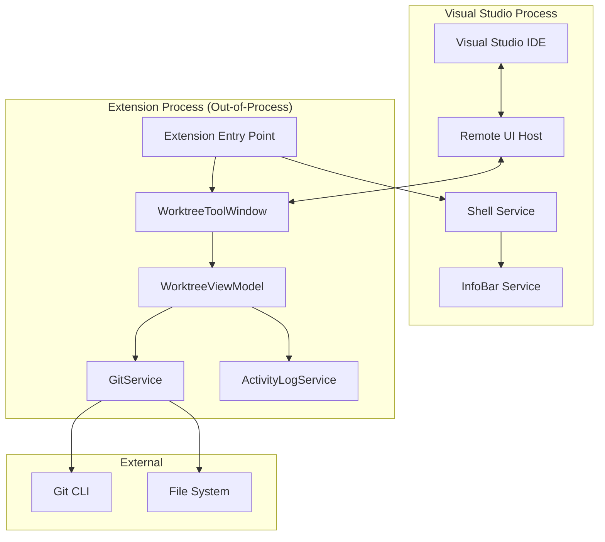
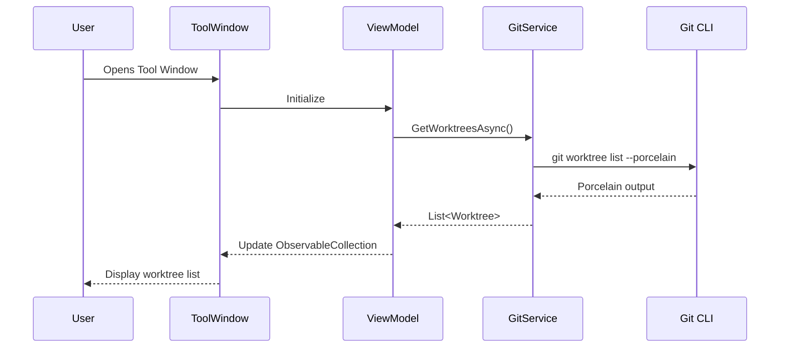

# Design Document

## Overview

The Git Worktree Manager is a Visual Studio 2022+ extension built using the VisualStudio.Extensibility SDK (out-of-process model). It provides a tool window interface for managing Git worktrees directly within the IDE. The extension follows MVVM architecture with Remote UI for the presentation layer, ensuring clean separation of concerns and testability.

The extension runs out-of-process from Visual Studio, communicating via the extensibility broker. This architecture provides improved reliability (extension crashes don't affect VS), modern async APIs, and installation without restart.

## Architecture



### Component Interaction Flow



## Components and Interfaces

### 1. Extension Entry Point

```csharp
namespace GitWorktreeManager;

[VisualStudioContribution]
public class GitWorktreeManagerExtension : Extension
{
    public override ExtensionConfiguration ExtensionConfiguration => new()
    {
        Metadata = new(
            id: "GitWorktreeManager.{guid}",
            version: this.ExtensionAssemblyVersion,
            publisherName: "Publisher",
            displayName: "Git Worktree Manager",
            description: "Manage Git worktrees from within Visual Studio")
    };
}
```

### 2. Tool Window

```csharp
namespace GitWorktreeManager.ToolWindows;

[VisualStudioContribution]
public class WorktreeToolWindow : ToolWindow
{
    private readonly WorktreeViewModel _viewModel;
    
    public WorktreeToolWindow(
        VisualStudioExtensibility extensibility,
        IGitService gitService,
        ILogger logger)
        : base(extensibility)
    {
        Title = "Worktree Manager";
        _viewModel = new WorktreeViewModel(gitService, extensibility, logger);
    }
    
    public override ToolWindowConfiguration ToolWindowConfiguration => new()
    {
        Placement = ToolWindowPlacement.DockedTo(
            KnownToolWindowGuids.SolutionExplorer, 
            Dock.Right),
        DockDirection = Dock.Right,
        AllowAutoCreation = true,
    };
    
    public override Task<IRemoteUserControl> GetContentAsync(
        CancellationToken cancellationToken)
    {
        return Task.FromResult<IRemoteUserControl>(
            new WorktreeToolWindowControl(_viewModel));
    }
}
```

### 3. IGitService Interface

```csharp
namespace GitWorktreeManager.Services;

public interface IGitService
{
    Task<GitCommandResult<IReadOnlyList<Worktree>>> GetWorktreesAsync(
        string repositoryPath, 
        CancellationToken cancellationToken = default);
    
    Task<GitCommandResult> AddWorktreeAsync(
        string repositoryPath,
        string worktreePath,
        string branchName,
        bool createBranch = false,
        CancellationToken cancellationToken = default);
    
    Task<GitCommandResult> RemoveWorktreeAsync(
        string repositoryPath,
        string worktreePath,
        bool force = false,
        CancellationToken cancellationToken = default);
    
    Task<string?> GetRepositoryRootAsync(
        string path,
        CancellationToken cancellationToken = default);
    
    Task<bool> IsGitInstalledAsync(
        CancellationToken cancellationToken = default);
}
```

### 4. Worktree Model

```csharp
namespace GitWorktreeManager.Models;

public record Worktree
{
    public required string Path { get; init; }
    public required string HeadCommit { get; init; }
    public string? Branch { get; init; }
    public bool IsMainWorktree { get; init; }
    public bool IsLocked { get; init; }
    public string? LockReason { get; init; }
    public bool IsPrunable { get; init; }
    public bool IsDetached => Branch is null;
}

public record GitCommandResult
{
    public bool Success { get; init; }
    public string? ErrorMessage { get; init; }
    public int ExitCode { get; init; }
}

public record GitCommandResult<T> : GitCommandResult
{
    public T? Data { get; init; }
}
```

### 5. ViewModel

```csharp
namespace GitWorktreeManager.ViewModels;

[DataContract]
public class WorktreeViewModel : INotifyPropertyChanged
{
    private readonly IGitService _gitService;
    private readonly VisualStudioExtensibility _extensibility;
    private readonly ILogger _logger;
    
    [DataMember]
    public ObservableCollection<WorktreeItemViewModel> Worktrees { get; }
    
    [DataMember]
    public bool IsLoading { get; private set; }
    
    [DataMember]
    public bool HasRepository { get; private set; }
    
    [DataMember]
    public string? ErrorMessage { get; private set; }
    
    [DataMember]
    public string? RepositoryPath { get; private set; }
    
    // Commands
    public IAsyncCommand RefreshCommand { get; }
    public IAsyncCommand AddWorktreeCommand { get; }
    public IAsyncCommand<WorktreeItemViewModel> RemoveWorktreeCommand { get; }
    public IAsyncCommand<WorktreeItemViewModel> OpenInNewWindowCommand { get; }
}

[DataContract]
public class WorktreeItemViewModel
{
    [DataMember]
    public required string Path { get; init; }
    
    [DataMember]
    public required string DisplayPath { get; init; }
    
    [DataMember]
    public required string BranchName { get; init; }
    
    [DataMember]
    public required string HeadCommit { get; init; }
    
    [DataMember]
    public bool IsMainWorktree { get; init; }
    
    [DataMember]
    public bool IsLocked { get; init; }
    
    [DataMember]
    public bool IsPrunable { get; init; }
    
    [DataMember]
    public bool CanRemove => !IsMainWorktree;
}
```

## Data Models

### Git Worktree Porcelain Output Format

The `git worktree list --porcelain` command outputs worktree information in a machine-parseable format:

```
worktree /path/to/main
HEAD abc123def456...
branch refs/heads/main

worktree /path/to/feature
HEAD def456abc789...
branch refs/heads/feature-branch
locked
locked reason: Working on critical fix

worktree /path/to/detached
HEAD 789abc123def...
detached
prunable
```

### Parsing Rules

1. Each worktree block starts with `worktree <path>`
2. `HEAD <commit>` contains the commit SHA
3. `branch <ref>` contains the full branch reference (or absent if detached)
4. `detached` indicates detached HEAD state
5. `locked` indicates the worktree is locked
6. `locked reason: <text>` provides the lock reason (optional)
7. `prunable` indicates the worktree can be pruned
8. Blocks are separated by empty lines

### GitService Porcelain Parser

```csharp
public static class WorktreeParser
{
    public static IReadOnlyList<Worktree> ParsePorcelainOutput(string output)
    {
        var worktrees = new List<Worktree>();
        var blocks = output.Split(
            new[] { "\n\n", "\r\n\r\n" }, 
            StringSplitOptions.RemoveEmptyEntries);
        
        foreach (var block in blocks)
        {
            var worktree = ParseWorktreeBlock(block);
            if (worktree != null)
            {
                worktrees.Add(worktree);
            }
        }
        
        // First worktree is always the main worktree
        if (worktrees.Count > 0)
        {
            worktrees[0] = worktrees[0] with { IsMainWorktree = true };
        }
        
        return worktrees;
    }
    
    private static Worktree? ParseWorktreeBlock(string block)
    {
        var lines = block.Split(
            new[] { '\n', '\r' }, 
            StringSplitOptions.RemoveEmptyEntries);
        
        string? path = null;
        string? head = null;
        string? branch = null;
        bool isLocked = false;
        string? lockReason = null;
        bool isPrunable = false;
        
        foreach (var line in lines)
        {
            if (line.StartsWith("worktree "))
                path = line[9..];
            else if (line.StartsWith("HEAD "))
                head = line[5..];
            else if (line.StartsWith("branch "))
                branch = ExtractBranchName(line[7..]);
            else if (line == "locked")
                isLocked = true;
            else if (line.StartsWith("locked reason: "))
                lockReason = line[15..];
            else if (line == "prunable")
                isPrunable = true;
        }
        
        if (path == null || head == null)
            return null;
        
        return new Worktree
        {
            Path = path,
            HeadCommit = head,
            Branch = branch,
            IsLocked = isLocked,
            LockReason = lockReason,
            IsPrunable = isPrunable,
        };
    }
    
    private static string ExtractBranchName(string fullRef)
    {
        // Convert refs/heads/branch-name to branch-name
        const string prefix = "refs/heads/";
        return fullRef.StartsWith(prefix) 
            ? fullRef[prefix.Length..] 
            : fullRef;
    }
}
```

## Error Handling

### Error Categories

1. **Git Not Installed**: Git executable not found in PATH
2. **Not a Repository**: Current folder is not a Git repository
3. **Command Failure**: Git command returned non-zero exit code
4. **Parse Error**: Unable to parse Git output
5. **File System Error**: Permission denied, path not found, etc.

### Error Handling Strategy

```csharp
public class GitService : IGitService
{
    private readonly ILogger _logger;
    
    public async Task<GitCommandResult<IReadOnlyList<Worktree>>> GetWorktreesAsync(
        string repositoryPath,
        CancellationToken cancellationToken)
    {
        try
        {
            _logger.LogInformation(
                "Executing git worktree list in {Path}", 
                repositoryPath);
            
            var result = await ExecuteGitCommandAsync(
                repositoryPath,
                "worktree list --porcelain",
                cancellationToken);
            
            if (!result.Success)
            {
                _logger.LogError(
                    "Git command failed: {Error}", 
                    result.ErrorMessage);
                return new GitCommandResult<IReadOnlyList<Worktree>>
                {
                    Success = false,
                    ErrorMessage = result.ErrorMessage,
                    ExitCode = result.ExitCode
                };
            }
            
            var worktrees = WorktreeParser.ParsePorcelainOutput(result.Output);
            
            _logger.LogInformation(
                "Found {Count} worktrees", 
                worktrees.Count);
            
            return new GitCommandResult<IReadOnlyList<Worktree>>
            {
                Success = true,
                Data = worktrees,
                ExitCode = 0
            };
        }
        catch (Exception ex)
        {
            _logger.LogError(ex, "Failed to get worktrees");
            return new GitCommandResult<IReadOnlyList<Worktree>>
            {
                Success = false,
                ErrorMessage = ex.Message,
                ExitCode = -1
            };
        }
    }
}
```

### InfoBar Notifications

```csharp
public static class NotificationService
{
    public static async Task ShowErrorAsync(
        VisualStudioExtensibility extensibility,
        string message,
        string? details = null)
    {
        var shell = extensibility.Shell();
        await shell.ShowPromptAsync(
            $"Git Worktree Manager Error: {message}",
            PromptOptions.OK,
            CancellationToken.None);
    }
    
    public static async Task ShowInfoBarAsync(
        VisualStudioExtensibility extensibility,
        string message,
        InfoBarSeverity severity = InfoBarSeverity.Information)
    {
        // Use VS InfoBar for non-blocking notifications
    }
}
```

## Testing Strategy

### Unit Testing Approach

The extension uses a dual testing approach:
- **Unit tests**: Verify specific examples, edge cases, and error conditions
- **Property-based tests**: Verify universal properties across all valid inputs

Both approaches are complementary - unit tests catch concrete bugs while property tests verify general correctness.

### Test Framework Configuration

- **Unit Testing**: xUnit with FluentAssertions
- **Property-Based Testing**: FsCheck.Xunit (minimum 100 iterations per property)
- **Mocking**: NSubstitute for service interfaces

### Test Categories

1. **WorktreeParser Tests**: Parsing porcelain output
2. **GitService Tests**: Command execution and error handling
3. **ViewModel Tests**: State management and command execution
4. **Integration Tests**: End-to-end scenarios with real Git


## Correctness Properties

*A property is a characteristic or behavior that should hold true across all valid executions of a system—essentially, a formal statement about what the system should do. Properties serve as the bridge between human-readable specifications and machine-verifiable correctness guarantees.*

The following properties are derived from the acceptance criteria and will be validated using property-based testing with FsCheck.Xunit (minimum 100 iterations per property).

### Property 1: Porcelain Parsing Round-Trip

*For any* valid Git worktree porcelain output string, parsing it into Worktree objects and then formatting those objects back to porcelain format should produce output that, when parsed again, yields equivalent Worktree objects.

**Validates: Requirements 2.2**

This is a round-trip property ensuring the parser correctly extracts all worktree information without data loss. The parser must handle:
- Worktree path extraction
- HEAD commit SHA extraction
- Branch name extraction (including refs/heads/ prefix stripping)
- Locked state and lock reason
- Prunable state
- Detached HEAD state

### Property 2: Worktree to ViewModel Serialization Round-Trip

*For any* valid Worktree model object, converting it to a WorktreeItemViewModel and extracting the data back should preserve all essential properties (path, branch, commit, status flags).

**Validates: Requirements 2.6**

### Property 3: Status Indicators Correctness

*For any* Worktree with `IsLocked = true`, the corresponding WorktreeItemViewModel must have `IsLocked = true`. Similarly, *for any* Worktree with `IsPrunable = true`, the corresponding WorktreeItemViewModel must have `IsPrunable = true`.

**Validates: Requirements 2.4, 2.5**

### Property 4: Git Command Construction Correctness

*For any* valid worktree path and branch name:
- The add worktree command must be formatted as `worktree add "<path>" <branch>` (with optional `-b` flag)
- The remove worktree command must be formatted as `worktree remove "<path>"` (with optional `--force` flag)
- The devenv launch command must include the worktree path as an argument

**Validates: Requirements 3.4, 4.3, 5.3**

### Property 5: Main Worktree Protection

*For any* Worktree where `IsMainWorktree = true`, the corresponding WorktreeItemViewModel must have `CanRemove = false`. Conversely, *for any* Worktree where `IsMainWorktree = false`, the WorktreeItemViewModel must have `CanRemove = true`.

**Validates: Requirements 4.1, 4.6**

### Property 6: Error Handling Completeness

*For any* GitCommandResult with `Success = false` and a non-empty `ErrorMessage`, when processed by the ViewModel, an error notification must be triggered that includes the original error message content.

**Validates: Requirements 3.7, 7.1, 7.2, 7.3**

### Property 7: Logging Completeness

*For any* Git command execution (success or failure), the logger must receive at least one log entry containing the command that was executed. *For any* exception thrown during execution, the logger must receive an error-level entry containing the exception message.

**Validates: Requirements 8.1, 8.2, 8.4, 8.5**

### Property 8: Event Debouncing

*For any* sequence of N solution change events occurring within the debounce window (e.g., 500ms), the GitService.GetWorktreesAsync method should be called at most once after the debounce period expires.

**Validates: Requirements 6.4**

### Property 9: PropertyChanged Notification

*For any* property on WorktreeViewModel that is marked with [DataMember], changing its value must raise the PropertyChanged event with the correct property name.

**Validates: Requirements 9.5**

### Property 10: Worktree Display Completeness

*For any* list of Worktree objects passed to the ViewModel, the resulting ObservableCollection must contain exactly the same number of items, and each WorktreeItemViewModel must contain non-null values for Path, BranchName (or "detached" indicator), and HeadCommit.

**Validates: Requirements 2.3**

### Property 11: Open Action Availability

*For any* WorktreeItemViewModel in the Worktrees collection, the "Open in New Window" action must be available (enabled), regardless of whether it's the main worktree or a linked worktree.

**Validates: Requirements 5.1**
