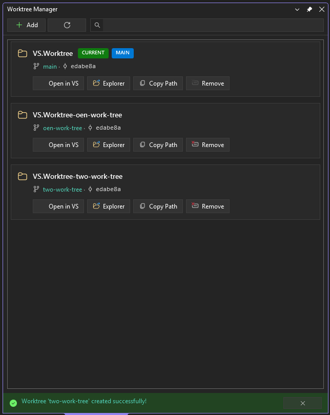
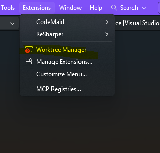
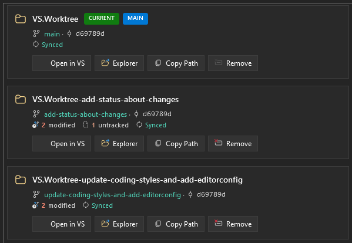
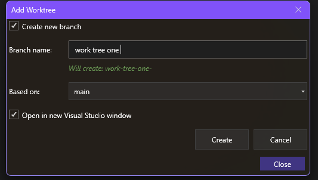
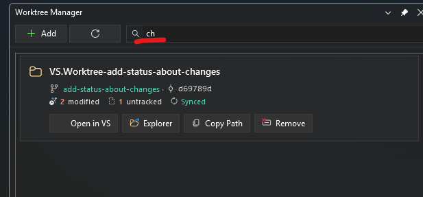
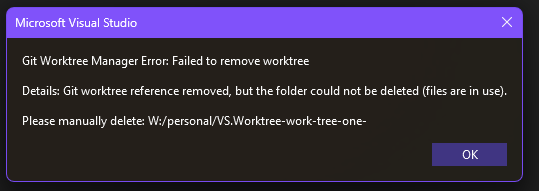

# Git Worktree Manager for Visual Studio

A Visual Studio extension that provides an intuitive interface for managing Git worktrees directly within the IDE.



## 📍 Easy Access

Access the Worktree Manager from the **Extensions** menu or **View > Other Windows**.



## Features

### 🌳 View All Worktrees at a Glance

See all your Git worktrees in a clean, card-based layout. Each worktree displays:
- Folder name and full path
- Current branch name
- Latest commit SHA
- Status badges (CURRENT, MAIN, LOCKED)



### ➕ Create New Worktrees

Easily create new worktrees with the Add dialog:
- Create a new branch or use an existing one
- Choose the base branch for new branches
- Auto-generated worktree path based on branch name
- Option to open the new worktree in VS immediately after creation



### 🔍 Search and Filter

Quickly find worktrees using the search box. Filter by:
- Folder name
- Branch name
- Full path



### 🚀 Quick Actions

Each worktree card provides quick action buttons:

| Action | Description |
|--------|-------------|
| **Open in VS** | Opens the worktree in a new Visual Studio instance |
| **Explorer** | Opens the worktree folder in Windows File Explorer |
| **Copy Path** | Copies the full path to clipboard |
| **Remove** | Removes the worktree (with safety checks) |


### 🛡️ Safety Features

- Cannot remove the currently open worktree
- Cannot remove the main worktree
- Clear error messages for locked files or uncommitted changes
- Handles partial failures gracefully (e.g., git reference removed but folder locked)



## Installation

1. Download the latest `.vsix` file from [Releases](https://github.com/AmanPriyanshu/GitWorktreeManager/releases)
2. Double-click the `.vsix` file to install
3. Restart Visual Studio

Or install from the Visual Studio Marketplace (coming soon).

## Requirements

- Visual Studio 2022 (17.10 or later)
- Git installed and available in PATH

## Contributing

Contributions are welcome! Here's how you can help:

1. **Fork** the repository
2. **Create** a feature branch (`git checkout -b feature/amazing-feature`)
3. **Commit** your changes (`git commit -m 'Add amazing feature'`)
4. **Push** to the branch (`git push origin feature/amazing-feature`)
5. **Open** a Pull Request

### Development Setup

```bash
# Clone the repository
git clone https://github.com/AmanPriyanshu/GitWorktreeManager.git

# Open in Visual Studio
start GitWorktreeManager.sln

# Build
dotnet build

# Run tests
dotnet test
```

### Project Structure

- `GitWorktreeManager/` - Main VS extension project
- `GitWorktreeManager.Core/` - Core library (Git operations, models)
- `GitWorktreeManager.Tests/` - Unit tests

## License

This project is licensed under the MIT License - see the [LICENSE](GitWorktreeManager/LICENSE.txt) file for details.

## Acknowledgments

- Built with [VisualStudio.Extensibility](https://github.com/microsoft/VSExtensibility)
- Icons from Visual Studio Image Library
