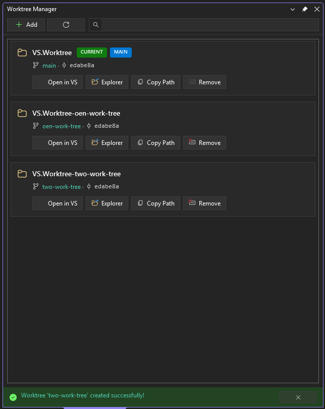
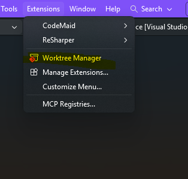
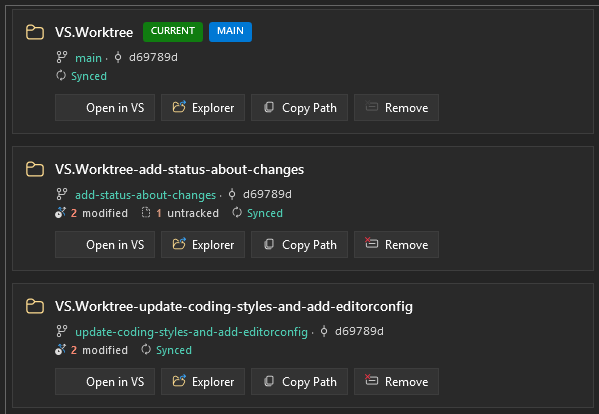
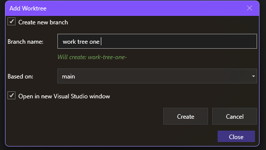
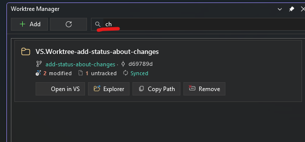
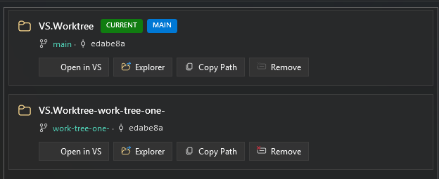
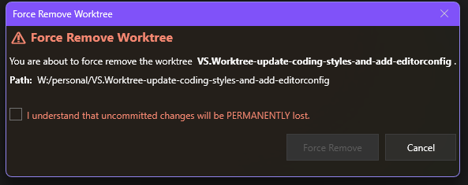
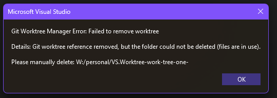

# Git Worktree Manager for Visual Studio

<p align="center">
  
</p>

A Visual Studio extension that provides an intuitive interface for managing Git worktrees directly within the IDE.

## 📦 Install

| IDE | Marketplace | Description |
|-----|-------------|-------------|
| **Visual Studio** | [Git Worktree Manager](https://marketplace.visualstudio.com/items?itemName=IAmBipinPaul.GitWorktreeManager) | Extension for Visual Studio 2022 (17.14+) |
| **JetBrains IDEs** | [Git Worktree Hub](https://plugins.jetbrains.com/plugin/30431-git-worktree-hub) | Plugin for IntelliJ IDEA, Rider, WebStorm, and other JetBrains IDEs |



## 📍 Easy Access

Access the Worktree Manager from the **Extensions** menu or **View > Other Windows**.



## Features

### 🌳 View All Worktrees at a Glance

See all your Git worktrees in a clean, card-based layout. Each worktree displays:
- Intelligent path shortening for easy identification
- Current branch name
- Latest commit SHA
- Status badges (CURRENT, MAIN, LOCKED)

### 🧠 Smart Path Display

When you have multiple worktrees, the extension automatically shows the shortest unique path for each worktree, making it easy to identify them at a glance even when they share common parent directories.

### 📊 Live Git Status

Get real-time insights into each worktree without switching branches:
- **Modified files**: Count of changed and staged files.
- **Untracked files**: Count of new files not yet tracked by Git.
- **Sync Status**: See exactly how many commits you are ahead or behind from upstream.
- **Local Only**: Clearly indicates worktrees with no upstream tracking branch.
- **Non-blocking**: Status is fetched asynchronously in the background so the UI stays snappy.



### ➕ Create New Worktrees

Easily create new worktrees with the Add dialog:
- Create a new branch or use an existing one
- Choose the base branch for new branches
- Auto-generated worktree path based on branch name
- Option to open the new worktree in VS immediately after creation



### 🔍 Search and Filter

Quickly find worktrees using the search box. Filter by:
- Folder name
- Branch name
- Full path



### 🚀 Quick Actions

Each worktree card provides quick action buttons:

| Action | Description |
|--------|-------------|
| **Open in VS** | Opens the worktree in a new Visual Studio instance (supports .sln and .slnx solutions) |
| **Explorer** | Opens the worktree folder in Windows File Explorer |
| **Copy Path** | Copies the full path to clipboard |
| **Remove** | Removes the worktree (includes **Force Remove** for dirty worktrees) |



### 🛡️ Safety Features

- **Force Remove**: Safely remove worktrees even with uncommitted changes using a confirmation safety dialog.



- **Protected Worktrees**: Cannot remove the currently open worktree or the main worktree.
- **Locked State**: Detects and displays locked worktrees with reasons.
- **Smart Enrichment**: Intelligent status fetching with timeouts to prevent hanging on large repositories.
- **Error Handling**: Handles partial failures gracefully (e.g., git reference removed but folder locked).




## Requirements

- Visual Studio 2022 (17.14 or later)
- Git installed and available in PATH

## Contributing

Contributions are welcome! Here's how you can help:

1. **Fork** the repository
2. **Create** a feature branch (`git checkout -b feature/amazing-feature`)
3. **Commit** your changes (`git commit -m 'Add amazing feature'`)
4. **Push** to the branch (`git push origin feature/amazing-feature`)
5. **Open** a Pull Request

### Development Setup

```bash
# Clone the repository
git clone https://github.com/iAmBipinPaul/GitWorktreeManager.git

# Open in Visual Studio
start GitWorktreeManager.sln

# Build
dotnet build

# Run tests
dotnet test
```

### Project Structure

- `GitWorktreeManager/` - Main VS extension project
- `GitWorktreeManager.Core/` - Core library (Git operations, models)
- `GitWorktreeManager.Tests/` - Unit tests

## License

This project is licensed under the MIT License - see the [LICENSE](LICENSE) file for details.

## Acknowledgments

- Built with [VisualStudio.Extensibility](https://github.com/microsoft/VSExtensibility)
- Icons from Visual Studio Image Library
