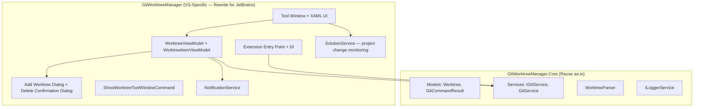

# Port Git Worktree Manager to JetBrains IDEs

## Background

The [Git Worktree Manager](../..) is a Visual Studio 2022 extension that provides an intuitive UI for listing, creating, removing, and switching between Git worktrees. The goal is to port this to a **JetBrains IntelliJ Platform plugin** so the same experience is available in IntelliJ IDEA, WebStorm, Rider, PyCharm, GoLand, and all other JetBrains IDEs.

> [!NOTE]
> This plan is based on the official [JetBrains Plugin Development documentation](https://plugins.jetbrains.com/docs/intellij/developing-plugins.html), using the **IntelliJ Platform Gradle Plugin 2.x** (`org.jetbrains.intellij.platform`) — the current recommended standard. The 1.x Gradle plugin is marked as **obsolete**.

---

## Existing VS Extension Architecture



### What can be reused (logic, not code)
The **Core** layer logic is directly portable — the same Git CLI commands, parsing, and result types apply. However, since the JetBrains platform uses **Kotlin/Java** (not C#), we will **rewrite** the core logic in Kotlin, preserving the same structure and algorithms.

### Key VS Concepts → JetBrains Equivalents

| VS Extension Concept | JetBrains IntelliJ Equivalent |
|---|---|
| `Extension` entry point | `Plugin` (declared in `plugin.xml`) |
| `IServiceCollection` (DI) | IntelliJ `service` system (`<projectService>` / `<applicationService>` in `plugin.xml`) |
| Tool Window (XAML) | [`ToolWindowFactory`](https://plugins.jetbrains.com/docs/intellij/tool-windows.html) registered via `<toolWindow>` in `plugin.xml` |
| XAML DataBinding + MVVM | Swing panel with IntelliJ UI components, state managed via coroutines |
| `DataContract` / Remote UI | Not needed — IntelliJ plugins run in-process |
| `VisualStudioExtensibility.Shell().ShowDialogAsync()` | [`DialogWrapper`](https://plugins.jetbrains.com/docs/intellij/dialog-wrapper.html) with `doValidate()` + `initValidation()` |
| `VisualStudioExtensibility.Shell().ShowPromptAsync()` | `Messages.showOkCancelDialog()` / `Messages.showInfoMessage()` |
| Solution/Project events | `ProjectManagerListener`, `VirtualFileListener` |
| `Process.Start("git", args)` | `GeneralCommandLine` + `CapturingProcessHandler` |
| Activity Log | IntelliJ `Logger` (`com.intellij.openapi.diagnostic.Logger`) |

---

## Proposed JetBrains Plugin Structure

Based on the official [Creating a Plugin Gradle Project](https://plugins.jetbrains.com/docs/intellij/creating-plugin-project.html) guide and [IntelliJ Platform Plugin Template](https://github.com/JetBrains/intellij-platform-plugin-template):

```
git-worktree-manager-intellij/
├── docs/
│   └── jetbrains_implementation_plan.md
├── build.gradle.kts                     # IntelliJ Platform Gradle Plugin 2.x
├── settings.gradle.kts                  # rootProject.name + repositories
├── gradle.properties                    # Plugin metadata, platform version, JDK 21
├── gradle/
│   └── wrapper/
│       └── gradle-wrapper.properties    # Gradle wrapper version
├── src/
│   └── main/
│       ├── kotlin/
│       │   └── com/iambipinpaul/gitworktreemanager/
│       │       ├── models/
│       │       │   ├── Worktree.kt               # Data class (port of Worktree.cs)
│       │       │   └── GitCommandResult.kt        # Sealed class (port of GitCommandResult.cs)
│       │       ├── services/
│       │       │   ├── GitService.kt              # Port of GitService.cs
│       │       │   ├── WorktreeParser.kt           # Port of WorktreeParser.cs
│       │       │   └── ProjectService.kt           # Port of SolutionService.cs
│       │       ├── toolwindow/
│       │       │   ├── WorktreeToolWindowFactory.kt
│       │       │   └── WorktreePanel.kt            # Swing/Kotlin UI DSL panel
│       │       ├── dialogs/
│       │       │   ├── AddWorktreeDialog.kt         # Port of AddWorktreeDialog
│       │       │   └── DeleteConfirmationDialog.kt  # Port of DeleteConfirmationDialog
│       │       ├── actions/
│       │       │   └── ShowWorktreeManagerAction.kt  # Menu action
│       │       └── notifications/
│       │           └── NotificationService.kt        # IntelliJ notification balloons
│       └── resources/
│           ├── META-INF/
│           │   ├── plugin.xml                        # Plugin descriptor
│           │   └── pluginIcon.svg                    # Plugin icon
│           └── messages/
│               └── GitWorktreeBundle.properties       # i18n strings
│   └── test/
│       └── kotlin/
│           └── com/iambipinpaul/gitworktreemanager/
│               ├── WorktreeParserTest.kt
│               └── GitServiceTest.kt
```

---

## Proposed Changes — Feature Mapping

### 1. Models

#### [NEW] Worktree.kt
Port of [Worktree.cs](../../GitWorktreeManager.Core/Models/Worktree.cs). Kotlin `data class` with same fields: `path`, `headCommit`, `branch`, `isMainWorktree`, `isLocked`, `lockReason`, `isPrunable`, computed `isDetached`.

#### [NEW] GitCommandResult.kt
Port of [GitCommandResult.cs](../../GitWorktreeManager.Core/Models/GitCommandResult.cs). Kotlin `sealed class` with `Success` and `Failure` subclasses (more idiomatic than the C# record pattern).

---

### 2. Services

#### [NEW] GitService.kt
Port of [GitService.cs](../../GitWorktreeManager.Core/Services/GitService.cs) (~500 lines).
- Replace `Process.Start` with IntelliJ's `GeneralCommandLine` + `CapturingProcessHandler`
- Use Kotlin coroutines (`suspend fun`) instead of `Task<T>`
- Same methods: `getWorktrees`, `addWorktree`, `removeWorktree`, `getRepositoryRoot`, `isGitInstalled`, `getBranches`, `getWorktreeStatus`

#### [NEW] WorktreeParser.kt
Port of [WorktreeParser.cs](../../GitWorktreeManager.Core/Services/WorktreeParser.cs) (~123 lines). Direct port of `parsePorcelainOutput` and `parseWorktreeBlock`.

#### [NEW] ProjectService.kt
Port of [SolutionService.cs](../../GitWorktreeManager/Services/SolutionService.cs) (~242 lines).
- Subscribe to IntelliJ `ProjectManagerListener` or `VirtualFileManager` events
- Detect project open/close/switch to refresh worktree list
- Same debouncing strategy

#### [NEW] NotificationService.kt
Port of [NotificationService.cs](../../GitWorktreeManager/Services/NotificationService.cs).
- Use `NotificationGroupManager.getInstance()` for balloon notifications
- Use `Messages.showErrorDialog()` for error prompts

---

### 3. UI — Tool Window

#### [NEW] WorktreeToolWindowFactory.kt
Port of [WorktreeToolWindow.cs](../../GitWorktreeManager/ToolWindows/WorktreeToolWindow.cs) (~268 lines).
- Implements `ToolWindowFactory` and registers in `plugin.xml`
- Creates and manages the `WorktreePanel`
- Handles project change events → refresh

#### [NEW] WorktreePanel.kt
Port of [WorktreeToolWindowControl.xaml](../../GitWorktreeManager/ToolWindows/WorktreeToolWindowControl.xaml) (~438 lines XAML) + [WorktreeViewModel.cs](../../GitWorktreeManager/ViewModels/WorktreeViewModel.cs) (~1241 lines).

This is the largest and most complex piece. The VS version uses XAML data binding; the JetBrains version will use Swing with IntelliJ's UI components:

| XAML Element | JetBrains Swing Equivalent |
|---|---|
| `ListView` with `DataTemplate` | `JBList` with custom `ListCellRenderer` |
| Card-style `Border` per item | Custom `JPanel` with `RoundedLineBorder` |
| `TextBox` (search) | `SearchTextField` |
| `Button` (Add, Refresh) | `ActionToolbar` with `AnAction` items |
| Status badges (CURRENT, MAIN, LOCKED) | `JBLabel` with custom background paint |
| Loading spinner | `AsyncProcessIcon` |
| Empty state messages | `StatusText` on `JBList` |
| Visibility bindings | Swing `CardLayout` or `setVisible()` |

Key UI features to replicate:
- **Card-based worktree list** with folder name, branch, commit SHA, status badges
- **Search/filter bar** in the toolbar
- **Action buttons** per card: Open in IDE, Open in Explorer, Copy Path, Remove
- **Loading indicator** while fetching
- **Live Git status** (modified, untracked, ahead/behind) fetched asynchronously
- **Empty states**: "No repository" and "No matching worktrees"
- **Theme-aware colors** using `JBColor` and `JBUI`

---

### 4. Dialogs

#### [NEW] AddWorktreeDialog.kt
Port of [AddWorktreeDialog.cs](../../GitWorktreeManager/Dialogs/AddWorktreeDialog.cs) and [AddWorktreeDialogData.cs](../../GitWorktreeManager/Dialogs/AddWorktreeDialogData.cs).
- Extends [`DialogWrapper`](https://plugins.jetbrains.com/docs/intellij/dialog-wrapper.html)
- Override `createCenterPanel()` to build the form UI
- Override `doValidate()` and call `initValidation()` for real-time validation (per official docs)
- Same features: toggle between "Create new branch" and "Use existing branch", base branch dropdown, auto-generated worktree path, "Open after creation" checkbox
- Use `ComboBox`, `JBTextField`, `JCheckBox`, `TextFieldWithBrowseButton` (for path)

#### [NEW] DeleteConfirmationDialog.kt
Port of [DeleteConfirmationDialog.cs](../../GitWorktreeManager/Dialogs/DeleteConfirmationDialog.cs) and [DeleteConfirmationDialogControl.xaml](../../GitWorktreeManager/Dialogs/DeleteConfirmationDialogControl.xaml).
- Extends [`DialogWrapper`](https://plugins.jetbrains.com/docs/intellij/dialog-wrapper.html)
- Override `doValidate()` to enforce checkbox confirmation before enabling OK button
- "Force remove" checkbox confirmation pattern
- Warning message with worktree name/path

---

### 5. Actions

#### [NEW] ShowWorktreeManagerAction.kt
Port of [ShowWorktreeToolWindowCommand.cs](../../GitWorktreeManager/Commands/ShowWorktreeToolWindowCommand.cs).
- `AnAction` subclass registered in `plugin.xml` under `Tools` menu and/or `VCS` menu
- Activates the tool window

---

### 6. Plugin Descriptor

#### [NEW] plugin.xml
Per the [Plugin Configuration File](https://plugins.jetbrains.com/docs/intellij/plugin-configuration-file.html) spec:
- `<id>`, `<name>`, `<version>`, `<vendor>` — plugin identity
- `<depends>com.intellij.modules.platform</depends>` — base platform
- `<depends>Git4Idea</depends>` — Git integration dependency
- `<extensions>` → `<toolWindow id="Git Worktrees" factoryClass="..." anchor="bottom" icon="..."/>` — [tool window registration](https://plugins.jetbrains.com/docs/intellij/tool-windows.html#declarative-setup)
- `<actions>` → action group under Tools/VCS menu
- `<extensions>` → `<projectService serviceImplementation="..."/>` — service declarations

#### [NEW] build.gradle.kts
Uses the three required Gradle plugins per official docs:
```kotlin
plugins {
    id("java")
    id("org.jetbrains.kotlin.jvm") version "..."
    id("org.jetbrains.intellij.platform") version "..."
}
```
- `dependencies` → `intellijPlatform { create("IC", "2025.1.7") }` for target IDE
- `pluginConfiguration` → `sinceBuild`, `untilBuild`, `changeNotes`
- `sourceCompatibility` → JDK 21 (required for 2025.1+ targets)

---

### 7. IDE-Specific Actions

| VS Action | JetBrains Equivalent |
|---|---|
| Open worktree in new VS instance | `ProjectUtil.openOrImport(path)` — opens in new IDE window |
| Open in Windows Explorer | `RevealFileAction.openFile(file)` or `BrowserUtil.browse()` |
| Copy path to clipboard | `CopyPasteManager.getInstance().setContents(StringSelection(path))` |

---

## User Review Required

> [!IMPORTANT]
> **Language Choice**: The plan assumes **Kotlin** as the primary language (JetBrains' recommended language for new plugins). If you prefer **Java**, the structure would be similar but more verbose.

> [!IMPORTANT]
> **UI Framework**: IntelliJ supports both traditional **Swing** (most common) and the newer **Kotlin UI DSL** (declarative). This plan uses Swing with IntelliJ components (`JBList`, `JBLabel`, etc.) for maximum compatibility. The Kotlin UI DSL v2 is an alternative for the dialogs.

> [!IMPORTANT]
> **Repo Structure (confirmed)**: Keep the JetBrains plugin in this repo under `git-worktree-manager-intellij/`. JetBrains-specific docs live in `git-worktree-manager-intellij/docs/`.

> [!WARNING]
> **"Open in IDE" behavior**: In VS, the extension opens the worktree in a new Visual Studio instance. In JetBrains, the equivalent is `ProjectUtil.openOrImport()` which opens in a new window of the same IDE. This is a behavioral match. However, if you want to open in a *different* JetBrains IDE (e.g., from Rider, open in WebStorm), additional logic would be needed.

---

## Phased Implementation Roadmap

### Phase 1 — Scaffold & Core (Est. 2–3 days)
- [ ] Set up project using [IntelliJ Platform Plugin Template](https://github.com/JetBrains/intellij-platform-plugin-template) or New Project Wizard with **IntelliJ Platform Gradle Plugin 2.x** (`org.jetbrains.intellij.platform`)
- [ ] Configure `build.gradle.kts` with platform target `IC 2025.1+`, JDK 21
- [ ] Port `Worktree.kt` and `GitCommandResult.kt` models
- [ ] Port `WorktreeParser.kt` with unit tests
- [ ] Port `GitService.kt` using `GeneralCommandLine` + `CapturingProcessHandler`

### Phase 2 — Tool Window MVP (Est. 3–4 days)
- [ ] Create `WorktreeToolWindowFactory` + `WorktreePanel`
- [ ] Implement worktree list rendering (card-style `JBList`)
- [ ] Add toolbar with Add + Refresh buttons
- [ ] Add search/filter functionality
- [ ] Implement loading state + empty states

### Phase 3 — Dialogs & Actions (Est. 2–3 days)
- [ ] Port `AddWorktreeDialog` as `DialogWrapper`
- [ ] Port `DeleteConfirmationDialog` as `DialogWrapper`
- [ ] Implement "Open in IDE", "Open in Explorer", "Copy Path" actions
- [ ] Implement remove worktree with force confirmation flow

### Phase 4 — Live Status & Project Events (Est. 2–3 days)
- [ ] Port async status enrichment (modified, untracked, ahead/behind counts)
- [ ] Port `ProjectService` — detect project changes and auto-refresh
- [ ] Implement status badges and summary tooltips
- [ ] Add `NotificationService` for error/warning balloons

### Phase 5 — Polish & Publish (Est. 2–3 days)
- [ ] Theme-aware styling (light + dark + high contrast)
- [ ] Plugin icon and marketplace assets
- [ ] Build `plugin.xml` with proper dependencies and compatibility range
- [ ] Test across IntelliJ IDEA, Rider, WebStorm
- [ ] Publish to JetBrains Marketplace

---

## Verification Plan

### Automated Tests
Port existing tests from [GitWorktreeManager.Tests](../../GitWorktreeManager.Tests):

- **WorktreeParserTest.kt**: Port [WorktreeParserTests.cs](../../GitWorktreeManager.Tests/WorktreeParserTests.cs) — verify parsing of `git worktree list --porcelain` output
- **GitServiceTest.kt**: Port [GitServiceIntegrationTests.cs](../../GitWorktreeManager.Tests/GitServiceIntegrationTests.cs) — integration tests against real Git repos

```bash
# Run tests from the plugin project root
./gradlew test
```

### Plugin Verification
```bash
# Build the plugin
./gradlew buildPlugin

# Run the IDE with the plugin installed (sandbox)
./gradlew runIde
```

### Manual Verification
1. **Open a Git repo** in IntelliJ → verify tool window appears and lists worktrees
2. **Create a worktree** via Add dialog → verify it appears in the list and on disk
3. **Remove a worktree** → verify confirmation dialog and removal
4. **Force remove** a dirty worktree → verify checkbox confirmation flow
5. **Search/filter** worktrees → verify filtering works
6. **Open in IDE** → verify new IDE window opens at worktree path
7. **Check status badges** → verify modified/untracked/ahead/behind counts
8. **Switch projects** → verify auto-refresh on project change
9. **Test in both light and dark themes** → verify UI is readable

> [!TIP]
> The `./gradlew runIde` task launches a sandboxed IntelliJ instance with the plugin pre-installed — ideal for rapid testing without manual installation.
